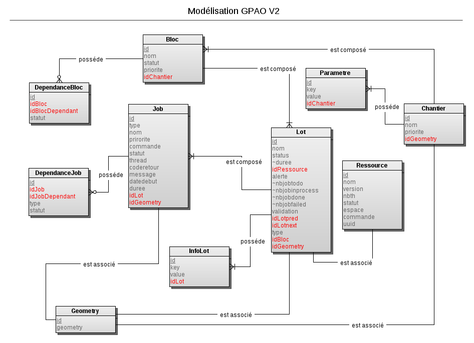

# Introduction

Ce projet a pour but de pouvoir lancer et de répartir des traitements sur plusieurs machine ou VM et de les traiter en sur plusieurs coeurs de calcul.

# Modele de données

### Actuellement



### Dans le futur

Nous étudions une nouvelle approche de la problématique avec un nouveau modèle composée de 4 tables : 

- Jobs

- Chantier

- Ressource

- Dépendance

## Architecture en utilisant docker-compose


## Architecture en en utilisant docker swarm

ToDo : Faire un jolie schéma

## Ouverture des ports

| Service       | Port | Url                            |
|:------------- | ---- | ------------------------------ |
| Postgres      | 5432 |                                |
| Api           | 8080 | http://localhost:8080/api/**** |
| Api doc       | 8080 | http://localhost:8080/api/doc  |
| Moniteur      | 8000 | http://localhost:8000/         |
| Client 1... N |      |                                |

## Lancement de la stack

A la racine du projet se trouve le script `build-image.sh` à lancer impérativement à la première utilisation car il permet de construire les images composant la stack applicative.

Ensuite le script `start.sh` lance les différents service en s'appuyant sur le fichier descriptif `docker-compose.yml``.

## Example d'appel de l'api

### Python

```python
import requests
import subprocess

# Récupération de tous les jobs de la base
x=requests.get('http://localhost:8080/api/jobs')

# recuperation d'un job a traiter
x=requests.get('http://localhost:3000/jobs')
job=x.json()[0]
print('Job a traiter : ', job)

# Traitement du job avec recuperation du code et des messages
proc = subprocess.Popen(job['command'], stdout=subprocess.PIPE)
(out, err) = proc.communicate()
status='done'
if (proc.returncode != 0):
    status='failed'

# mise a jour de la Bd
x=requests.put('http://localhost:3000/jobs/'+str(job['id']), data={'status':status, 'log':out})
print(x.text)
```
